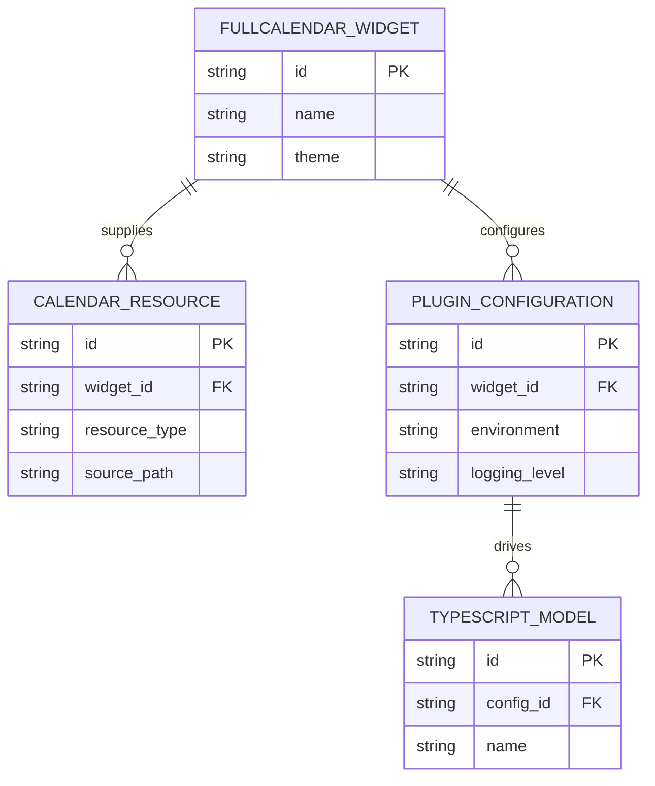

# ERD — Core Plugin Domain

While FullCalendar Pro is a lightweight extension library, the core domain revolves around configuring the enhanced calendar experience and exposing it to pages.

```mermaid
erDiagram
  FULLCALENDAR_WIDGET {
    string id PK
    string name
    string theme
  }
  CALENDAR_RESOURCE {
    string id PK
    string widget_id FK
    string resource_type
    string source_path
  }
  PLUGIN_CONFIGURATION {
    string id PK
    string widget_id FK
    string environment
    string logging_level
  }
  TYPESCRIPT_MODEL {
    string id PK
    string config_id FK
    string name
  }

  FULLCALENDAR_WIDGET ||--o{ CALENDAR_RESOURCE : supplies
  FULLCALENDAR_WIDGET ||--o{ PLUGIN_CONFIGURATION : configures
  PLUGIN_CONFIGURATION ||--o{ TYPESCRIPT_MODEL : drives
```
