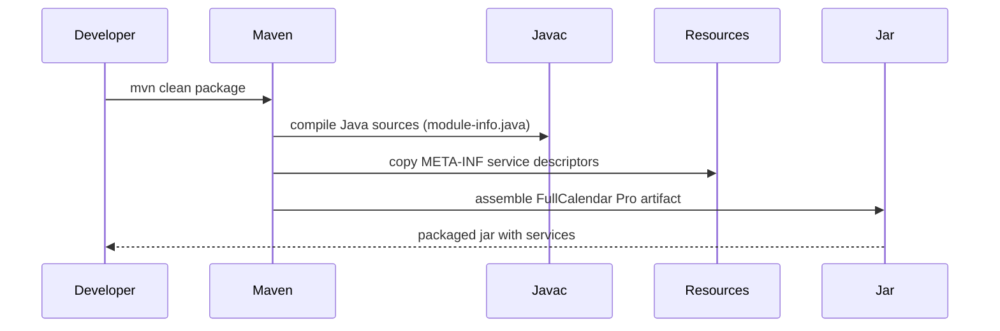

# Sequence Diagram — Plugin Packaging Flow

This flow traces how a developer or CI system packages the FullCalendar Pro plugin for distribution.

```mermaid
sequenceDiagram
  participant Developer
  participant Maven
  participant Javac
  participant Resources
  participant Jar

  Developer->>Maven: mvn clean package
  Maven->>Javac: compile Java sources (module-info.java)
  Maven->>Resources: copy META-INF service descriptors
  Maven->>Jar: assemble FullCalendar Pro artifact
  Jar-->>Developer: packaged jar with services
```
