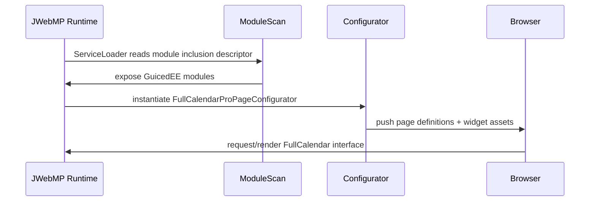

# Sequence Diagram — Runtime Integration Flow

This diagram shows what happens when a JWebMP application loads the FullCalendar Pro jar at runtime.

```mermaid
sequenceDiagram
  participant Runtime as JWebMP Runtime
  participant ModuleScan
  participant Configurator
  participant Browser

  Runtime->>ModuleScan: ServiceLoader reads module inclusion descriptor
  ModuleScan->>Runtime: expose GuicedEE modules
  Runtime->>Configurator: instantiate FullCalendarProPageConfigurator
  Configurator->>Browser: push page definitions + widget assets
  Browser->>Runtime: request/render FullCalendar interface
```
